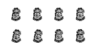

# Minitiles
🟪🟨🟨🟩🟨🟩🟨🟨🟨🟪

Jogo criado pra [PROCJAM 2021](https://itch.io/jam/procjam).

O script de desenho do tabuleiro é baseado em um algoritmo de [random walk](https://en.wikipedia.org/wiki/Random_walk), guiado por um grid 2D e com algumas simplificações.

O minigame de navinha foi baseado [nesses tutoriais de TIC 80](https://www.youtube.com/watch?v=D_GyozNZeVo&list=PL61kTUcYddBMIkVHQQI1Q8OgVRp_M8Alg&index=25).

O joguinho de pesca é **fortemente** baseado nos minigames da serie Zelda.

O sub game de  ping pong é **fortemente** inspirado em jogos como Pong, SuperStar Ping Ping e Breakout. 

O simulador de batalha de Final Fantasy é uma cópia descarada de Breath of Fire.

por Tiago e Ricardo.
